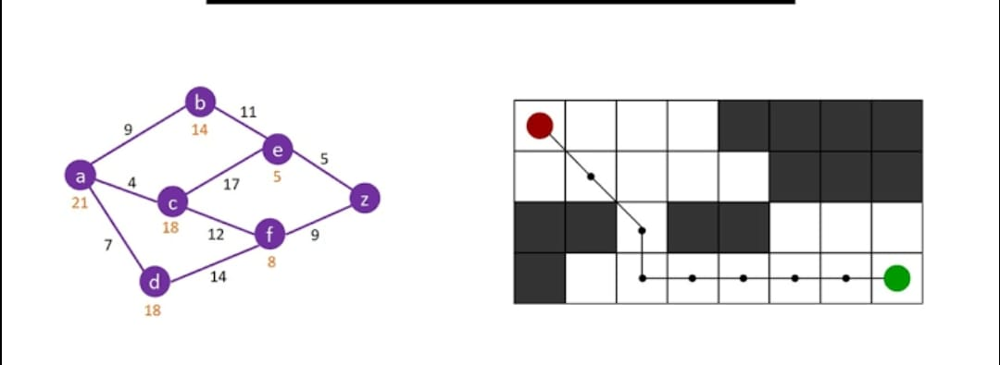

# Snapchat

*Course Name*  
Algorithmic Problem Solving

*Course Code*  
23ECSE309

*Name*  
Kshitij Singh

*University*  
KLE Technological University, Hubballi-31

*Course Instructor*  
Prakash Hegade

*USN*  
01FE21BCS314

### This page hosts:

1. [*Introduction*](#introduction)
2. [*Market Analysis*](#market-analysis)
3. [*Objectives*](#objectives)
4. [*Business Use Cases*](#business-use-cases)

## Introduction

Snapchat is an American multimedia instant messaging app and service developed by Snap Inc., originally Snapchat Inc. One of the principal features of Snapchat is that pictures and messages are usually only available for a short time before they become inaccessible to their recipients. The app has evolved from originally focusing on person-to-person photo sharing to presently featuring users' "Stories" of 24 hours of chronological content, along with "Discover", letting brands show ad-supported short-form content. It also allows users to store photos in a password-protected area called "My Eyes Only". It has also reportedly incorporated limited use of end-to-end encryption, with plans to broaden its use in the future.

Snapchat was created by Evan Spiegel, Bobby Murphy, and Reggie Brown, former students at Stanford University. It is known for representing a mobile-first direction for social media, and places significant emphasis on users interacting with virtual stickers and augmented reality objects. In July 2021, Snapchat had 293 million daily active users, a 23% growth over a year. On average more than four billion Snaps are sent each day. Snapchat is popular among the younger generations, particularly those below the age of 16, leading to many privacy concerns for parents.

## Market Analysis

Snapchat's main users are teenagers and young adults, mostly between the ages of 13 and 24. The app is very popular in North America and Europe, and it is also growing in places like Asia and Latin America. Snapchat faces competition from other social media apps such as Instagram, TikTok, Facebook, and WhatsApp. The app has seen a steady increase in users due to new features and higher engagement. Recent trends in the market include the use of augmented reality (AR), short-form video content, and a greater focus on privacy.

Snapchat makes money primarily through advertising, where ads are shown in the Discover section and Stories. They also earn from in-app purchases like filters and lenses, and through partnerships with brands for special content. However, Snapchat faces challenges like keeping users engaged, balancing the number of ads with user experience, and addressing privacy concerns. To stay ahead, Snapchat must continue to innovate and improve its features while maintaining user trust.

## Objectives

- Enhance user engagement through real-time messaging and interactive features.
- Optimize user experience by efficiently managing and accessing user-generated content.
- Enable personalized interactions and content discovery through advanced search and recommendation systems.
- Ensure smooth and fast performance even with increasing user numbers.

## Business Use Cases

1. **User Profile Management**
   - **Use Case**: Efficient management of user profiles.
   - **Challenges**: Managing millions of profiles efficiently and ensuring minimal hash collisions to maintain performance.
   - **Algorithm**: Hash Map.
   - **Description**: A Hash Map is used to store user profiles, allowing quick insertion, deletion, and retrieval operations. This ensures efficient management of user data, supporting seamless user interaction and profile updates in Snapchat.
   - **Time Complexity**: O(1) for average-case operations (insertion, deletion, retrieval).
   - **Space Complexity**: O(n), where n is the number of user profiles stored.
   - **Code**: [Click here](https://github.com/kshitij583415/aps.github.io/blob/main/code/hash.cpp) [1]

2. **Friend List Management**
   - **Use Case**: Efficiently managing user friend connections.
   - **Challenges**: Handling large graphs with millions of users and ensuring DFS performs well with deep friend connections.
   - **Algorithm**: Depth-First Search (DFS).
   - **Description**: DFS explores friend connections, efficiently managing user friend lists.
   - **Time Complexity**: O(V + E).
   - **Space Complexity**: O(V).
   - **Code**: [Click here](https://github.com/kshitij583415/aps.github.io/blob/main/code/dfs.cpp) [2]

3. **Snapchat Memories Storage**
   - **Use Case**: Efficiently storing and retrieving user memories to ensure quick access and management.
   - **Challenges**: Maintaining performance with a large number of memories and ensuring data integrity during updates.
   - **Algorithm**: B-Trees.
   - **Description**: B-Trees efficiently store and retrieve user memories, ensuring quick access and management of large amounts of data.
   - **Time Complexity**: 
     - Search: O(log_B n)
     - Insertion: O(log_B n)
     - Deletion: O(log_B n)
     (where n is the number of memories stored and B is the branching factor of the B-Tree).
   - **Space Complexity**: O(n) for storing n memories.
   - **Code**: [Click here](https://github.com/kshitij583415/aps.github.io/blob/main/code/btree.cpp) [3]

4. **Real-Time Messaging**
   - **Use Case**: Sending and receiving messages instantly.
   - **Challenges**: Ensuring messages are delivered in real-time under high user load and managing message queue efficiently.
   - **Algorithm**: Queue (FIFO).
   - **Description**: A FIFO Queue manages the order of messages, ensuring they are sent and received in the order they were sent.
   - **Time Complexity**: O(1).
   - **Space Complexity**: O(n).
   - **Code**: [Click here](https://github.com/kshitij583415/aps.github.io/blob/main/code/queue.cpp) [4]

5. **Snapchat Stories Compilation**
   - **Use Case**: Merging snaps into a story.
   - **Challenges**: Handling large volumes of snaps and maintaining chronological order under high traffic conditions.
   - **Algorithm**: Merge Sort.
   - **Description**: Merge Sort organizes snaps by timestamp, ensuring stories are displayed chronologically for users.
   - **Time Complexity**: O(n log n).
   - **Space Complexity**: O(n).
   - **Code**: [Click here](https://github.com/kshitij583415/aps.github.io/blob/main/code/merge.cpp) [5]

6. **Snap Map Navigation**
   - **Use Case**: Navigating through Snap Maps.
   - **Challenges**: Finding the shortest path quickly in a large and dynamic graph, and handling real-time updates to map data.
   - **Algorithm**: Dijkstra's Algorithm.
   - **Description**: Dijkstra's Algorithm finds the shortest path on Snap Maps, optimizing navigation for users based on distance and traffic conditions.
   - **Time Complexity**: O((V + E) log V).
   - **Space Complexity**: O(V + E).
   - **Code**: [Click here](https://github.com/kshitij583415/aps.github.io/blob/main/code/dj.cpp) [6]

   

7. **Snapchat Analytics**
   - **Use Case**: Analyzing user engagement with snaps and stories.
   - **Challenges**: Handling and processing large volumes of data efficiently and ensuring real-time analytics for immediate insights.
   - **Algorithm**: Counting Sort.
   - **Description**: Counting Sort organizes viewer data efficiently, facilitating analytics on snap and story engagement.
   - **Time Complexity**: O(n + k).
   - **Space Complexity**: O(n + k).
   - **Code**: [Click here](https://github.com/kshitij583415/aps.github.io/blob/main/code/count.cpp) [7]

   

8. **Search Functionality Enhancement**
   - **Use Case**: Improving search speed for user profiles.
   - **Challenges**: Handling a large number of profiles and ensuring fast and accurate search results.
   - **Algorithm**: Trie (Prefix Tree).
   - **Description**: Trie is used to store user profile names efficiently, enabling fast prefix-based searches and enhancing search functionality for users.
   - **Time Complexity**: O(m), where m is the length of the search query.
   - **Space Complexity**: O(n * L), where n is the number of user profiles and L is the average length of profile names.
   - **Code**: [Click here](https://github.com/kshitij583415/aps.github.io/blob/main/code/trie.cpp) [8]

    

9. **Geolocation-based Snap Stories**
   - **Use Case**: Displaying local snaps on Snap Maps.
   - **Challenges**: Efficiently handling and querying geolocation data, and ensuring real-time updates for accurate local stories.
   - **Algorithm**: R-Tree.
   - **Description**: R-Tree organizes geolocation data of snaps, optimizing retrieval and display of local stories on Snap Maps.
   - **Time Complexity**: O(m) for search operations, where m is the length of the search query.
   - **Space Complexity**: O(n * L), where n is the number of user profiles and L is the average length of profile names.
   - **Code**: [Click here](https://github.com/nushoin/RTree/blob/master/RTree.h)

10. **Snapchat Streaks Tracking**
    - **Use Case**: Tracking streaks between users.
    - **Challenges**: Ensuring accurate and real-time tracking of streaks and managing the priority queue efficiently.
    - **Algorithm**: Priority Queue.
    - **Description**: Priority Queue manages streaks based on activity, ensuring accurate tracking and notification of streak statuses.
    - **Time Complexity**: O(log n).
    - **Space Complexity**: O(n) for storing streak data.
    - **Code**: [Click here](https://github.com/kshitij583415/aps.github.io/blob/main/code/priority.cpp) [9]

    

11. **Snapchat Filters Application**
    - **Use Case**: Applying real-time filters to snaps.
    - **Challenges**: Ensuring filters are applied in real-time and handling a large number of filter options efficiently.
    - **Algorithm**: Hash Table.
    - **Description**: Hash Table stores filter parameters and efficiently applies them to snaps, enhancing user experience with real-time filter application.
    - **Time Complexity**: O(1).
    - **Space Complexity**: O(n).
    - **Code**: [Click here](https://github.com/kshitij583415/aps.github.io/blob/main/code/hash.cpp)

12. **Snapchat Notification Management**
    - **Use Case**: Managing notifications for snaps and messages.
    - **Challenges**: Ensuring timely delivery of notifications and efficiently managing a large number of notifications.
    - **Algorithm**: Binary Search Tree (BST).
    - **Description**: BST organizes and manages notifications based on user preferences, ensuring efficient notification delivery and management.
    - **Time Complexity**: O(log n) for insertion, deletion, and retrieval operations in BST.
    - **Space Complexity**: O(n).
    - **Code**: [Click here](https://github.com/kshitij583415/aps.github.io/blob/main/code/bst.cpp) [10]

    

13. **Discover Content Recommendation**
    - **Use Case**: Recommending personalized content in the Discover section.
    - **Challenges**: Providing relevant recommendations in real-time based on user preferences and behavior.
    - **Algorithm**: Binary Search Tree (BST) 
    - **Description**:  A Binary Search Tree augmented with user preferences stores and retrieves content recommendations efficiently, ensuring personalized recommendations in the Discover section.
    - **Time Complexity**: O(log n) for insertion, deletion, and retrieval operations in BST.
    - **Space Complexity**:  O(n) for storing user preferences and content features.
    - **Code**: [Click here](https://github.com/kshitij583415/aps.github.io/blob/main/code/bst.cpp)

14. **Snapchat Ad Targeting**
    - **Use Case**: Targeting ads to users based on their behavior and preferences.
    - **Challenges**: Accurately targeting ads without compromising user privacy and managing large datasets efficiently.
    - **Algorithm**: Hash Map.
    - **Description**: Hash Map allows fast lookup and storage of user preferences, enabling efficient ad targeting based on behavior and preferences while maintaining user privacy.
    - **Time Complexity**: O(1) for average-case operations (insertion, deletion, retrieval).
    - **Space Complexity**: O(n) for storing user data.
    - **Code**: [Click here](https://github.com/kshitij583415/aps.github.io/blob/main/code/hash.cpp)

15. **Snapchat Video Compression**
    - **Use Case**: Compressing videos to reduce storage and bandwidth usage.
    - **Challenges**: Maintaining video quality while achieving high compression ratios and ensuring real-time processing.
    - **Algorithm**: Huffman Coding.
    - **Description**: Huffman Coding compresses videos efficiently, reducing storage and bandwidth usage while maintaining video quality.
    - **Time Complexity**: O(n log n) for building the Huffman tree.
    - **Space Complexity**: O(n) for storing compressed video data.
    - **Code**: [Click here](https://github.com/kshitij583415/aps.github.io/blob/main/code/huffman.cpp) [11]

    

16. **Snapchat Augmented Reality (AR) Filters Application**
    - **Use Case**: Applying real-time augmented reality (AR) filters to snaps.
    - **Challenges**: Ensuring AR filters are applied seamlessly in real-time, managing a variety of filter options efficiently, and optimizing performance on mobile devices.
    - **Algorithm**: A* Algorithm 
    - **Description**: The A* Algorithm helps to find the best way to use augmented reality (AR) filters on snaps quickly. It looks through many possible choices to find the best one. It tries to balance finding the right choice with how much effort it takes. This helps make sure AR filters work well on different devices, making the experience smoother for users.
    - **Time Complexity**: O(( V + E ) log V)
    - **Space Complexity**: O( V ) 
    - **Code**: [Click here](https://github.com/kshitij583415/aps.github.io/blob/main/code/a.cpp) [12]

    

## Refrences
[1] Medium-"HashMaps in C++" [Link](https://medium.com/@vinay.vashist2003/hashmaps-in-c-f9da8651dcff)
[2] GeeksforGeeks-"DFS for a Graph" [Link](https://www.geeksforgeeks.org/depth-first-search-or-dfs-for-a-graph/)
[3] GeeksforGeeks-"B*-Trees implementation in C++" [Link](https://www.geeksforgeeks.org/b-trees-implementation-in-c/)
[4] Programiz-C++ Queue [Link](https://www.programiz.com/cpp-programming/queue)
[5] GeeksforGeeks-"C++ Program For Merge Sort" [Link](https://www.geeksforgeeks.org/cpp-program-for-merge-sort/)
[6] GeeksforGeeks-"C / C++ Program for Dijkstra’s shortest path algorithm" [Link](https://www.geeksforgeeks.org/c-program-for-dijkstras-shortest--algorithm-greedy-algo-7/) 
[7] GeeksforGeeks-"C++ Program For Counting Sort" [Link](https://www.geeksforgeeks.org/cpp-program-for-counting-sort/)
[8] GeeksforGeeks-"Trie Data Structure" [Link](hpathttps://www.geeksforgeeks.org/trie-insert-and-search/)
[9] GeeksforGeeks-"Priority Queue in C++" [Link](https://www.geeksforgeeks.org/priority-queue-in-cpp-stl/)
[10] GeeksforGeeks-"Binary Search Tree" [Link](https://www.geeksforgeeks.org/cpp-binary-search-tree/)
[11] GeeksforGeeks-"Huffman Coding" [Link](https://www.geeksforgeeks.org/huffman-coding-greedy-algo-3/)
[12] GeeksforGeeks-"A* Algorithm" [Link](https://www.geeksforgeeks.org/a-search-algorithm/)
